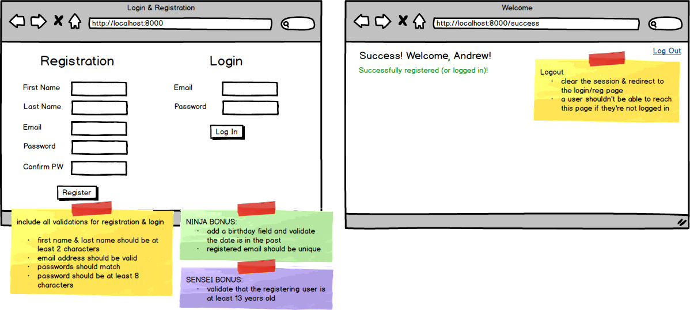

# Assignment: Login and Registration
### Objectives:

- Build a login and registration page with validations
- Practice Flash messages
- Practice session

It's time to build Login and Registration again, this time using Django.

We’ve learned how to integrate models, validations, and controllers to our projects. Our next goal is to create a fully functional login and registration app! This will combine your knowledge of MVC patterns, validations, and password encryption.

Registration should adhere to the following guidelines:

    - First Name - required; at least 2 characters; letters only
    - Last Name - required; at least 2 characters; letters only
    - Email - required; valid format
    - Password - required; at least 8 characters; matches password confirmation

### Something to Consider
#### User.objects.get(email = email)

If there is not a matching email for a .get(), Django throws an error (try and except could come in handy), otherwise it returns the User object associated with the matching user. e.g. Userobject.

#### User.objects.filter(email = email)

Filter, on the other hand, returns a list, so if there is no user that matches, it returns an empty list. If there is a single matching user the list will contain a single User object: e.g. [Userobject].

- [x] Create a new Django project with a login app

- [x] Have the root route render a page where users can register or log in

- [x] Complete the registration method, including showing errors if the input is invalid

- [x] Complete the login method, including showing errors if the input is invalid

- [x] Upon successful registration or login, redirect to a success page, displaying the user's name and a message as shown above

- [x] Have the logout link clear the session and redirect to the login/reg page

- [x] Don't allow a user who is not logged in to reach the /success route (i.e. by making a GET request in the address bar)

- [ ] NINJA BONUS: Add a birthday field and validate that the user's birthday is in the past

- [ ] NINJA BONUS: Validate that the email provided for registration is unique

- [ ] SENSEI BONUS: Add a birthday field and validate that the user is at least 13 years old (COPPA compliant!)

- [ ] SENSEI BONUS: Validate the email uniqueness with AJAX

- [ ] SENSEI BONUS: Use JavaScript to perform client-side validations

- [ ] SENSEI BONUS: In addition to server side validations, use JavaScript to perform client-side validations on required fields. Don't allow the form to be submitted unless fields are valid.