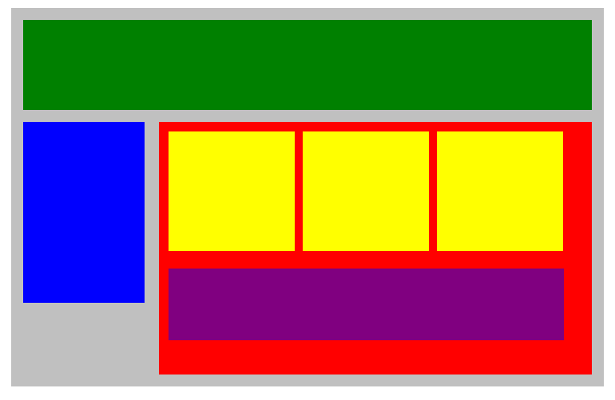

# Plotting Our Blocks

Try to duplicate the image below by adjusting the CSS code provided.
Use **margins** and **paddings** to adjust the spaces between divisions and use the **display** property to be able to put each block in its proper place. We may need additional CSS properties.

Here's the HTML code:

<code>
<!DOCTYPE html>

<html lang="en">
<head>
    <title>Position Practice</title>
    <link rel="stylesheet" type="text/css" href="style.css">
</head>
<body>
    

        

        

        

            

            

            

            

        

    

</body>
</html>
</code>
