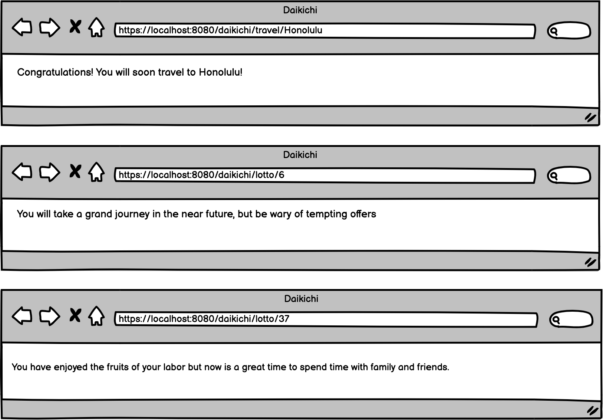

# Daikichi Path Variables
Now that you have created the Hello Human application using query parameters, you're going to handle information sent through the url another way, through path variables to return varying computed string responses back to the client.

### Objectives:
Become familiar with creating a package in Spring Tool Suite.
Use and understand `@RestController` annotation.
Pass information from the client using `@RequestMapping` and URL path variables.
Identify and use correctly the `@PathVariable` annotation and corresponding parameter declaration syntax.
Use `@RequestMapping` to process information from the client to return conditional or varied responses.

### Assignment:
For this assignment we are going to add to our Daikichi Routes project. To review, the first three routes, from our Daikichi Routes assignment used the `@RequestMapping` annotation with static route urls. The last two routes will be dynamic, and use path variables, so you will also need to use the `@PathVariable` annotation.

Adding request mappings to your Daikichi project, complete the assignment tasks given. Here is some example output:

- [x] Add 2 new routes with corresponding method definitions in your Daikichi Routes project that will accept path variables.

- [x] Have an http GET request to 'http://localhost:8080/daikichi/travel/kyoto' where the url will take any string for the city, and display text that says for example, 'Congratulations! You will soon travel to kyoto!'.

- [x] Have an http GET request to 'http://localhost:8080/daikichi/lotto/8', where the url will take any integer. If the number is even, display text that says 'You will take a grand journey in the near future, but be weary of tempting offers'. If it is odd, display text that says "You have enjoyed the fruits of your labor but now is a great time to spend time with family and friends."