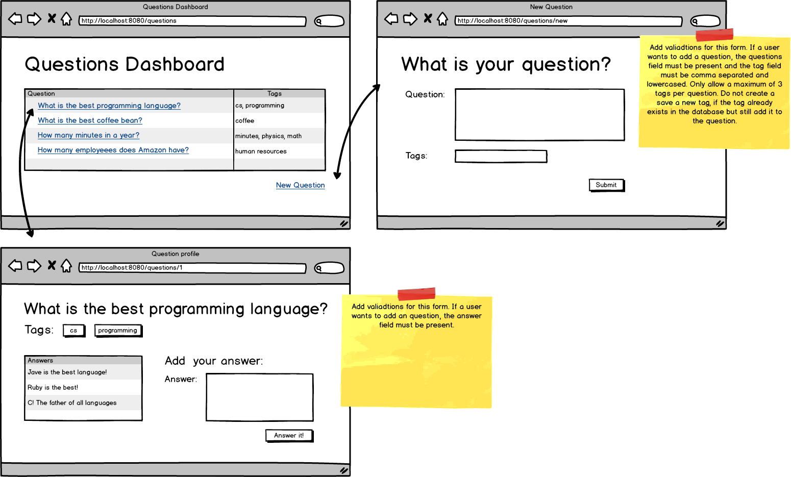

# Dojo Overflow Assignment

In this tab, you will be creating a StackOverflow / Quora clone. Users will be able to create questions, answers, and add tag subjects for the questions.

### Topics:

- Relationships
- Validations
- Domain Models
- JPA methods

### ERD and Wireframe

- [x] Have the question dashboard display each question and their tags.

- [x] Allow users to create questions with tags and implement validation errors.

- [x] Allow users to answer questions and implement validation errors.

- [x] Have the question show page display all the answers for that specific questions.
