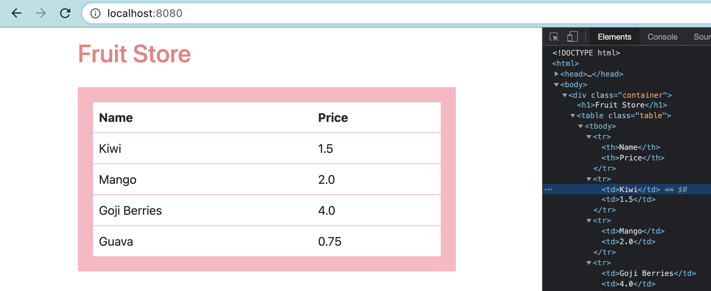

# Fruity Loops
For this assignment we will practice using the c:forEach tag to dynamically render lists in our templates. We will also be brushing up a little on our OOP again . It may be helpful to keep your Order/Item Assignments, for reference on how to access member variables from an object instance, for example.

### Objectives:
- Practice setting up dependencies and imports for using JSP and the JSTL in a Spring project.
- Review OOP concepts
Access member variables of an object instance from within a JSP file.
- Become familiar with the c:forEach JSTL tags
- Understand the correct syntax for using variables within JSTL tags e.g. when to use ${someVariable} within  c:out tags vs. a string literal.

### Assignment:
For this assignment you'll be building this wireframe, dynamically rendering a list from your controller.



We're going to start by making a new project. Don't forget to add all the dependencies! In addition to making a controllers package for our controllers, we will also be making a models package to house our models. A model is a just another name for a class. In Model View Controller (MVC) design patterns, classes are called models, because they model the data from the database, in order to manipulate it. For now, we do not have a database yet, but that doesn't stop us from implementing classes anyway!

### Item Class
Let's dust off our Item class from way back a million years ago in the Java Fundamentals section. 

```md
public class Item {
    
    // MEMBER VARIABLES
    private String name;
    private double price;
    
    // CONSTRUCTOR
    public Item(String name, double price) {
        this.name = name;
        this.price = price;
    }
    
    // As always, don't forget to generate Getters and Setters!
}
````

You should set member variables to private unless you have an explicit reason not to. Likewise, whether or not you set your variables to public or private, you should always generate getters and setters, for two important reasons. 

It is convention.
Dependencies rely on your getters and setters.
Because it is convention, many dependencies and other parts of the framework, like the view engine used for rendering, will rely on your getters and setters, as part of what's called inversion of control.

Specifically, in this case, when dealing with the view model, that is, the Model model,  the view engine will use your getters and setters when rendering them to the JSP page, which is why you don't need to explicitly call your getters in your JSP, but you DO need to include getters and setters in your model for your it to be used properly. Thus, you can use thisItem.name instead of  thisItem.getName() in your JSP file, even if you have access set to private.

### Item Controller
Next, in your controllers package, create your controller as per usual. We'll start you off with some code, and you can take it from there.

```md
// ... imports (Use shift+ctrl+O or shift+cmd+O to import as you code)
@Controller
public class ItemController {
    
    @RequestMapping("/")
    public String index(Model model) {
        
        ArrayList<Item> fruits = new ArrayList<Item>();
        fruits.add(new Item("Kiwi", 1.5));
        fruits.add(new Item("Mango", 2.0));
        fruits.add(new Item("Goji Berries", 4.0));
        fruits.add(new Item("Guava", .75));
        
        // Add fruits your view model here
        
        return "index.jsp";
    }
}
````
Now, using the new-fangled c:forEach JSTL syntax you learned, and your expertise with OOP, recreate the wireframe above to display a list of fruits and their prices. 

Note: it is NOT required to style it exactly as the wireframe, but do add some of your own styling to flex those css muscles.


