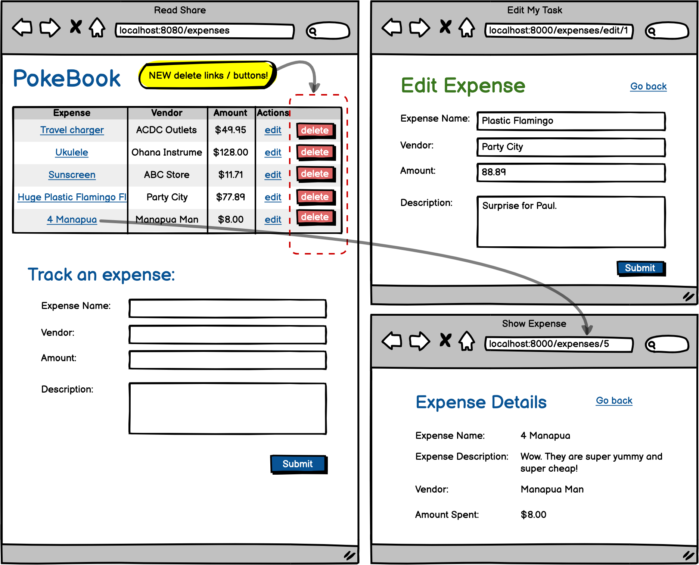

# Full CRUD PokeBook

And finally, the last step to make our little pocket book app fully ready to track our expenses is to add delete functionality for our users. When you finish this assignment, not only will your hypothetical friend be super appreciative they get to climb up to the top of a volcano with out worrying about their expenses, but you will have finished a monster project. As you wrap up this assignment, take some time to celebrate completing your first full-CRUD, full-stack assignment!

### Objectives:

- Implement delete functionality.
- Show details for a particular expense.
- Complete a Full-Stack, Full-CRUD application!
  _Note_: While it is a good idea to practice using RESTful routing by adding delete mapping, the aim of this assignment is for you to understand how to implement a delete feature, so if you find yourself stuck and need to use a POST or GET mapping for your delete, that's fine.

- [x] Add delete buttons to the index.jsp

- [x] Make a new route that will process a delete and redirect to the "/expenses". The record should disappear from the table.

- [x] Add a new JSP to show details for a single expense.

- [x] Add a route to render the single expense details "/expenses/2"

- [x] On your index page, change the expense names into anchor tags, that map to the details page for that particular expense.
