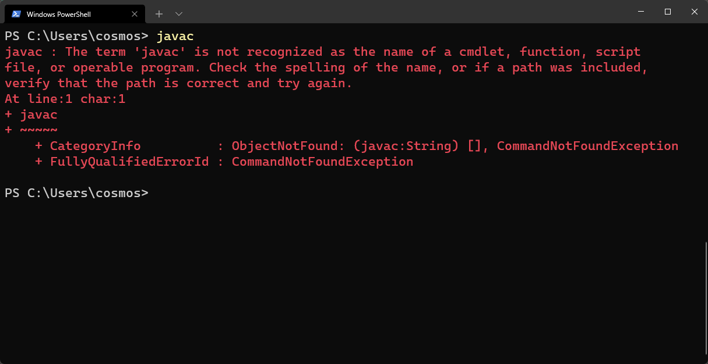
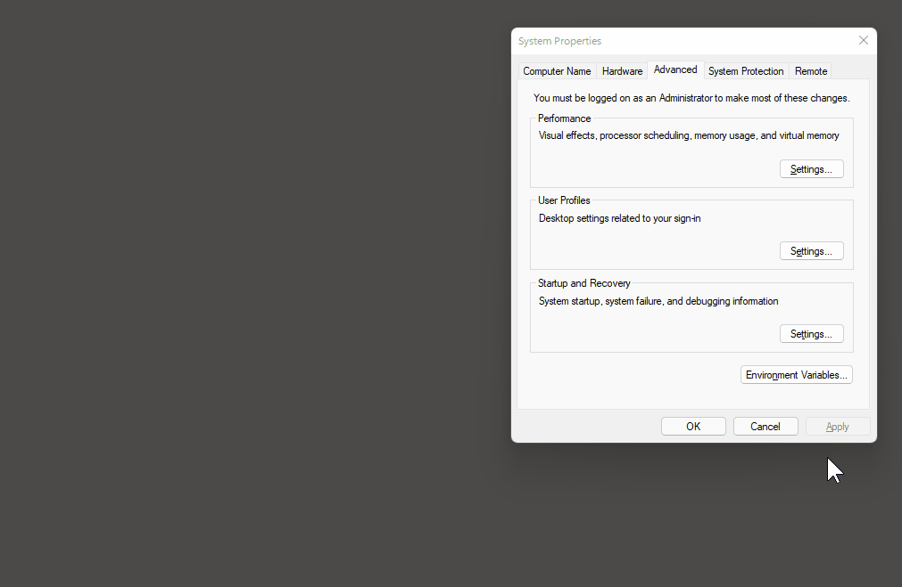
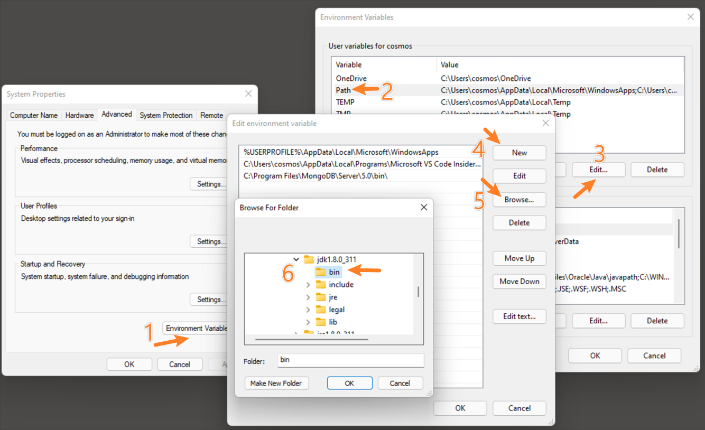
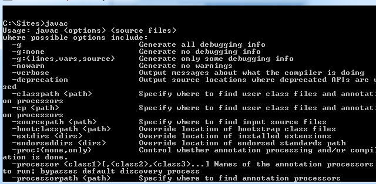

# JDK Installation

Install the JDK be ready to start coding!

### Installation
Note: We are using the JDK for Java SE (Standard Edition) 8.

1. To download the JDK, visit the following link and select the appropriate package according to your operating system. Don't forget to Accept the License Agreement. Oracle is the most secure option to download the JDK, so if they require you to create an account, we recommend doing so.

[JDK 8 Download](http://www.oracle.com/technetwork/java/javase/downloads/jdk8-downloads-2133151.html)

2. After you download, run the file and follow the instructions of the installer. You should be able to click "Next" until you reach the end of the installation.

To check if the installation has been successful, open your terminal and type `javac`. If you see a list of options for using the `javac` command, you have successfully installed the JDK.

If you see the error above, it means that the installer did not put javac into your PATH variable automatically. This error is most common for Windows users.

### Setting Path Variables (Windows 10)
From the Desktop, right-click the very bottom left corner of the screen to get the Power User Task Menu.
From the Power User Task Menu, click System.
Click the Advanced System Settings link in the left column.
In the System Properties window, click on the Advanced tab.
From there, follow these steps as shown in the graphics below.

Click the Environment Variables button near the bottom of that tab.

In the Environment Variables window, highlight the Path variable in the "User variables" section, or if the Path variable does not exist yet, add it.

Click the Edit button.

With the edit window open, listing path variables, click New

Then click Browse and navigate to your c-drive Program Files. In the java folder, you should see a jdk folder listed.

Select the bin folder with in your jdk folder.

Click OK on each of the dialogue boxes to save.

Open your terminal and run javac once again.

