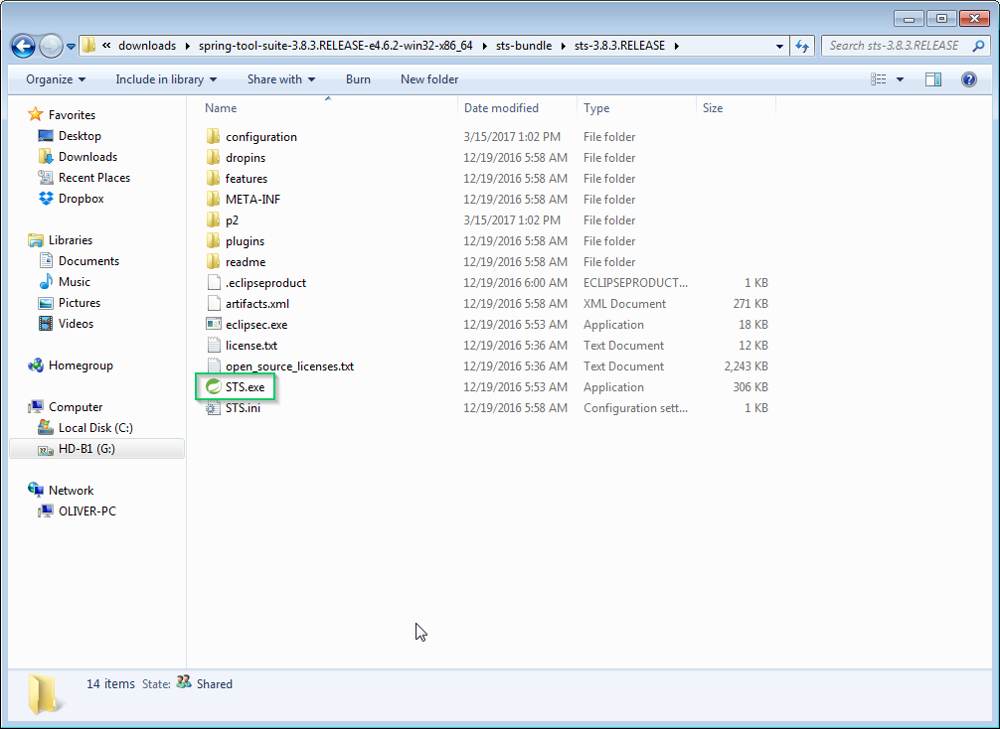
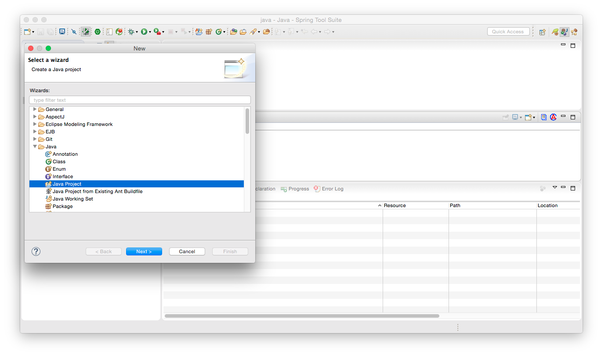
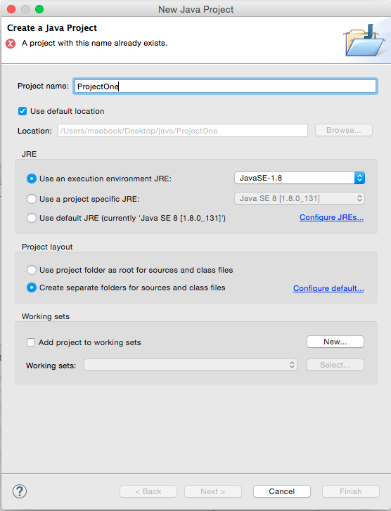
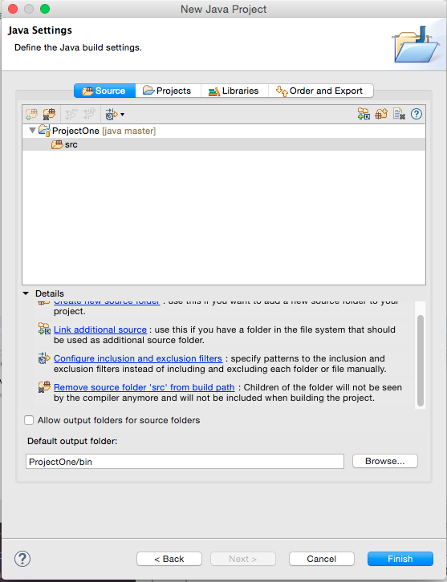
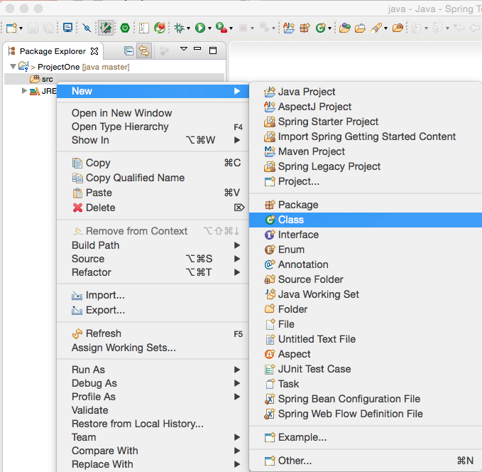
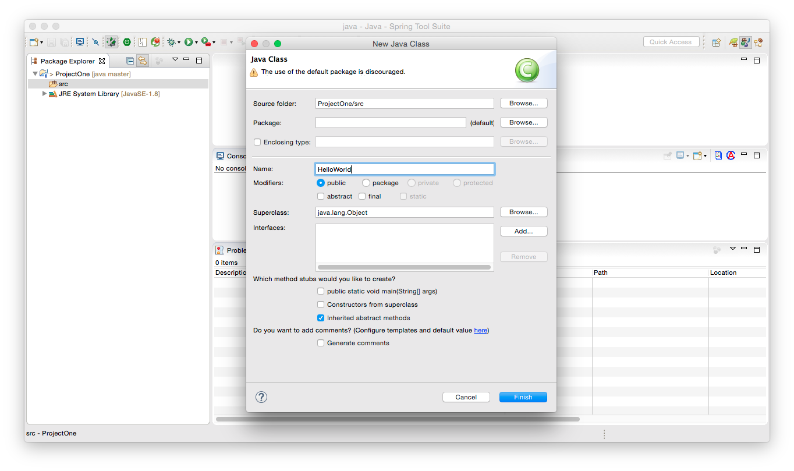
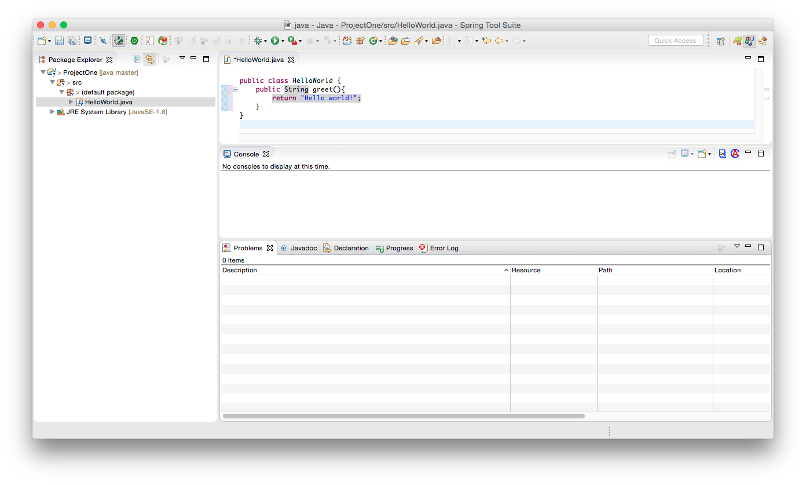
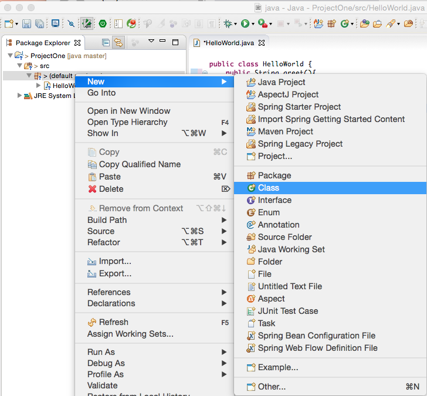
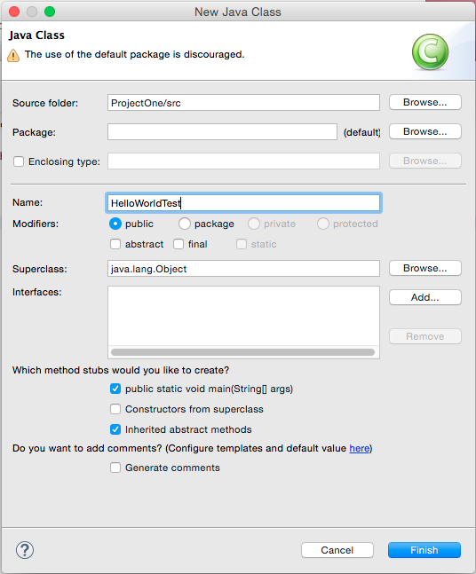
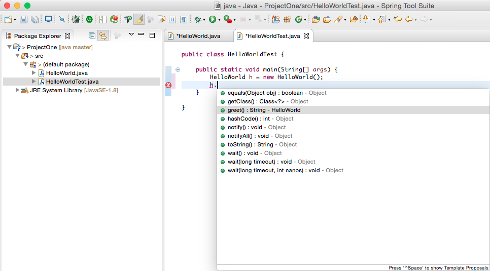

# Spring Tool Suite (STS)

### Objectives:

- What is an IDE?
- Installing and using Spring Tool Suite

At this point, you have written out at least a few "getters" and "setters," and you may have noticed some repetition. You may have also tried compiling with an error or two and been frustrated with the results. It is likely you have also forgotten to include an import statement or two as well. There are other Java developers out there just like you, who also got sick of all these things happening to them; more importantly, there are organizations and people that have sought to address these frustrations, and they have created many different Integrated Development Environments (IDE).

### Integrated Development Environment

Every IDE seeks to do one thing: make a programmer's life more simple. They do this in a huge variety of ways, but the most important features we will be utilizing are:

- Code generation (automatically generate getters/setters)
- Project organization
- Error catching (the syntax highlighter will show us - errors before compilation time)
- Code completion (we can't memorize every single class member)
- Code compilation
  Why haven't we been doing this the entire time?!

### IDE vs. Text Editor

IDE's are one-stop-shops that do everything. They sometimes do all of it well, and they sometimes don't. There are many competing ones, and each of them claims to be the best. They are huge beasts compared to text editors and can take a long period of time to master.

Raw text editors, on the other hand, are lightweight and precise. They will always do exactly what you expect of them, nothing more and nothing less. Learning Java initially on a text editor will help to familiarize you with what you need to know that IDEs are doing for you, and what to do if an IDE starts messing up on you!

### Which IDE?

There are many to choose from, listed below, but for the Spring applications that we will be building eventually, we will be using the [Spring Tool Suite](https://spring.io/tools). Given that we will be using this during that portion of the course, it is best to get familiar with it now, as an IDE can take some time to gain familiarity and comfort with. You can, and should, explore other IDEs once you are done.

### STS

Spring Tool Suite (STS) is an Eclipse-based (a popular IDE for building Java Applications) development environment that is customized for developing Spring applications.

#### Installation

Download the latest version of STS [(Spring Tool Suite)](https://spring.io/tools) and install it on your system.

If it is your first time launching STS, it will ask you where you want to save your projects. Choose the path you want them saved in, and that's it!

#### Windows Specific notes:

Unzip the downloaded file and navigate to a folder called `sts-*.*.*.RELEASE` where the `*` are numbers.

Once you are in that folder, you can just simply double click on a file called STS.exe to run your STS IDE

### New Projects

For new projects you will just want to create a `Java Project` for now, you can reach this screen by going to the "New wizard":

On the next screen you will name your project and finish the project creation:

Once you have done this, you can create a new class by right clicking on the `src` directory and selecting `new -> class`:

After this, you will need to give your class a name. Notice the warning about "default packages." We can ignore this for now:

Then we create our class as we normally would:

As well as the testing class for it:

Notice that here we checked "public static void main(String[] args)". This will automatically create this method for us.

Next, we can start writing some code, and immediately start using the IDE to our full advantage:

There's a lot more that you can do with it, instead of writing out all your getters and setters, try to figure out how to "generate getters and setters" using the STS (which is eclipse) IDE.

#### Executing code:

Be sure to have the console open ( `window -> show view -> console` ); this will allow you to see the output from your project. Once this is open, you can run your project by right clicking on it and selecting `Run As -> Java Application`.

#### Where did my class files go?

You may have noticed that you will no longer see your class files being generated or shown. Rest assured they are there; your IDE just knows that you can't read them, so it does not bother showing them to you. Try exploring your project directory via the command line and see where the packages ended up!

#### Useful Links:

[Spring Tool Suite](https://spring.io/tools)
[Eclipse - entirely Open Source](https://eclipse.org/)
[IntelliJ IDEA - developed by Jet Brains](https://www.jetbrains.com/idea/specials/idea/idea.html)
[Net Beans - entirely Open Source, not widely used](https://netbeans.org/)
[BlueJ - IDE for learning Java](https://bluej.org/)
