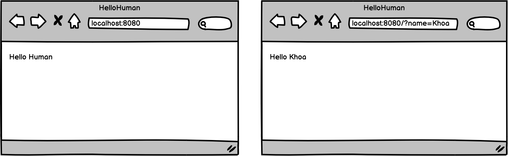
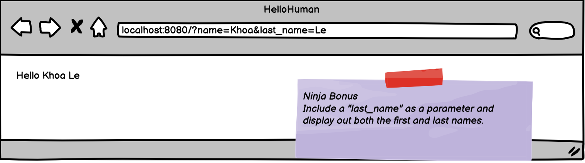
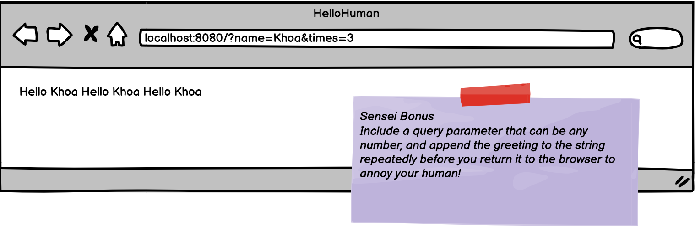

# Hello Human

You are tasked to build a page that will greet whoever visits your page. If they don't tell you their name, then greet them as "human".

### Objectives:

- Use url strings to pass query parameter values to the server
- Use data passed to the server through request parameters in a response to the client.

### Assignment

Create an app that will show in the browser either a default value of "human" or the name provided in the URL query string. Please note, you may show simple text without any html formatting.

Ninja Bonus (Optional):

Can you include a "last_name" as a parameter and print out both the first and last names?

Sensei Bonus (Optional):

Include a route that takes a parameter times and returns a string that repeats the greeting that many times on the page.

- [x] Create an app that will show in the browser either a default value of "human" or with the name provided in the URL query string.

- [x] NINJA BONUS: Include a "last_name" as a parameter and print out both the first and last names.

- [ ] SENSEI BONUS: Add a "times" parameter and show the greeting that many times.
