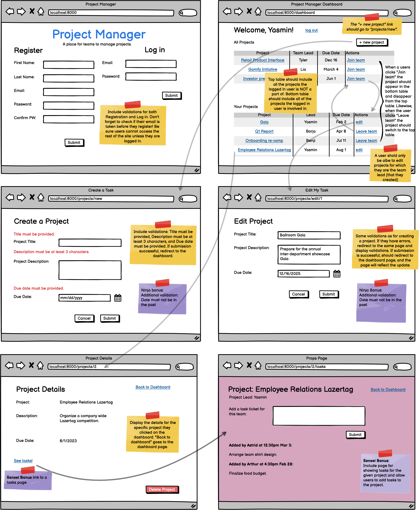

# Project Manager Extra Belt Review

### Objectives:

- Prepare you for black belt features you may see on an exam.
- Build many-to-many relationships into a full-featured application, to prepare for project week.

Note: The ninja bonuses are features that you would see as Black Belt features. Indeed some functionality on the dashboard would also likely be a black belt feature. This assignment is more difficult than a belt exam, so if you complete this assignment you should be able to earn a black belt.

- [x] Implement the models and relationships outlined in the above wireframe.

- [x] Include all the pages seen in the wireframe for the regular features.

- [x] Ensure login & registration is complete

- [x] Users can create projects (and automatically become team lead)

- [x] Users can edit projects they created

- [x] Validations are present on create & update

- [x] The dashboard page shows a table with all the projects the user is not involved in

- [x] The dashboard page shows a table with all the project the user IS involved in.

- [x] A user is only able to edit and delete projects they created.