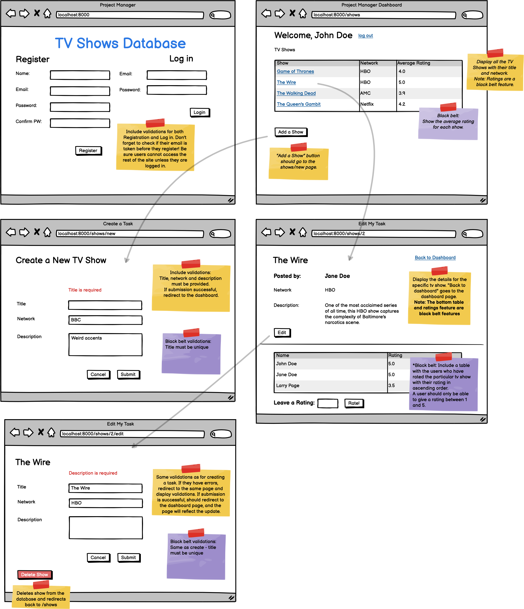

# Option F (TVDB)

Create a platform where you can create, read, update and destroy tv shows.
Proficiency Requirements (for a Red Belt):
Login and Registration with Spring Security or BCrypt.
Login/Logout feature should ensure a user cannot access the dashboard unless logged in.
CRUD
Display all the tv shows with their title and network.
Users can create new shows.
Display the title, network and description of a specific tv show as well as the user who posted it.
Show the edit page of a specific tv show.
Able to update a specific show.
Able to delete a specific show.
Include validations for create and update
Routing
Follow the ReSTful convention.
Validations
Add the correct validations for the registration and login.
Add the correct validations for the show on create and update.
Additional Mastery Features (toward earning a Black Belt):
Deployed on Amazon EC2
Implement the rating feature. A tv show can get a rating score ranging from 1 to 5.
Display a table with the users and their ratings for that show.
Implement at least one of the following:
Get the average rating for each tv show.
Display the users and ratings in ascending order.
Add the following validations when creating a show: Title must be unique.
User should not be able to access any pages they shouldn't be able to.
Note: Red belt is 8.0 and above. For a detailed point breakdown see the full rubric.
General Guidelines
Do everything the prompts ask for. Ask your instructor if you are not sure
You can download the wireframe here: TV Shows
You must deploy to earn a Black Belt. For a Black Belt, assume you need to implement all the Mastery features. However, point values vary, so in some cases you still earn a black belt without all, but it will depend on point allocation, so do the best you can!
Note: Black belt is 9.5 and above. For a detailed point breakdown see the full rubric.
