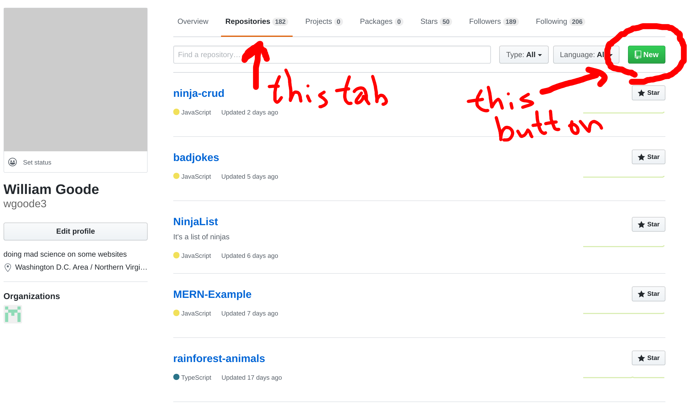
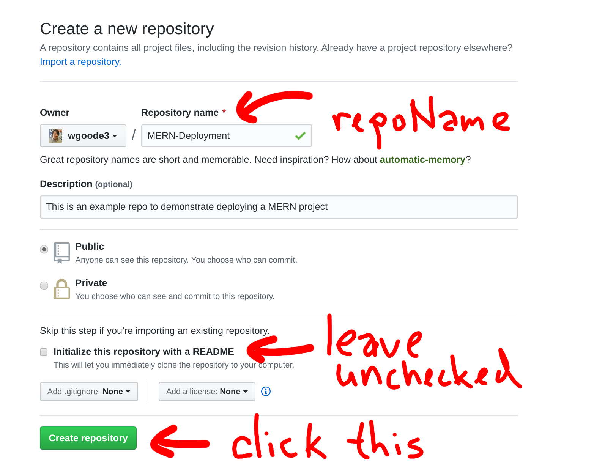
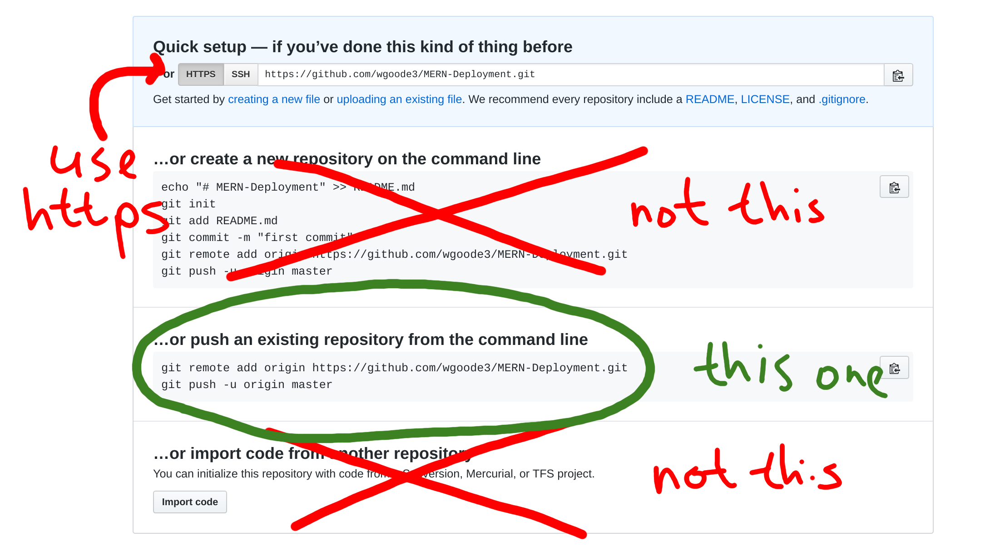
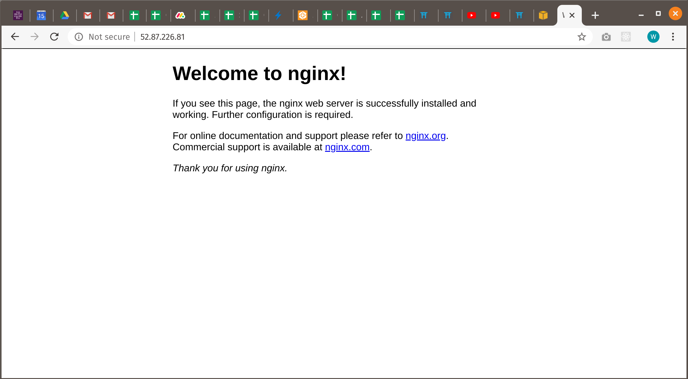
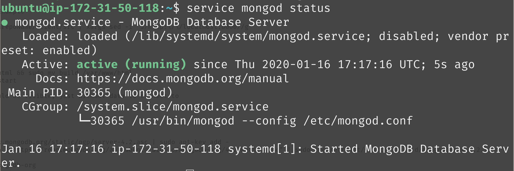

# Deployment
### Push Your Code to GitHub
Before we get started, we need to get our project onto GitHub. Change directory (cd) into the folder that contains our `client/` and  `server/` folders.

```md
├─ project-name/
| ├─ client/
| | ├─ node_modules/
| | ├─ public/
| | ├─ src/
| | ├─ package.json
| ├─ server/
| | ├─ config/
| | ├─ controllers/
| | ├─ node_modules/
| | ├─ models/
| | ├─ routes/
| | ├─ package.json
| | ├─ server.js
````

Inside of this project-name folder, we will be making a file called .gitignore. The .gitignore file will allow us to tell git which files and folders we don't want it to track or commit. As the contents of our node_modules folders are rather large and can easily be re-downloaded we will be making sure these don't get pushed to GitHub.

```md
echo node_modules/ > .gitignore
````

This command will create a file called .gitignore and make its contents the text node_modules/.

Next, we will need to remove any git repositories that already exist inside of our client folder. When we run the npx create-react-app client command, Create React App will add in a git repository by default and as we wish to push all of our project to github as one repository we will need to remove this now. While we're inside of our client folder, we also want to create a production build of our code (basically transcode all that fancy JSX into vanilla HTML, CSS, and JS) that our user's computer will be able to understand.

**IMPORTANT:** don't forget to npm run build before we push our code to GitHub.

```md
cd client
npm run build
````

| MacOS and Git BASH | Windows CMD |
| -------------------| ------------|
| ``` rm -rf .git```   | ``` rmdir /s .git``` |
| ``` rm .gitignore```   | ``` del /f .gitignore``` |

Next we will initialize a git repository, add all of our code to it (ignoring node_modules) and create a commit with the message "initial commit".

```md
cd ..
git init
git add .
git commit -m "initial commit"
````

Next we need to create a GitHub repository. After logging into GitHub, click on the repositories tab followed by the green button that says "New".



Next type in a name for your new repository "MERN-Deployment" works well and click on the "Create repository" button.


Then we will set the remote origin and push our code to it.


```md
git remote add origin https://github.com/your_github_username/MERN-Deployment.git
git push -u origin master
````

Your project should now be on GitHub. Yay!

### Set up your server instance on AWS

To get started, [login to AWS](https://console.aws.amazon.com/ec2/v2/home#Instances:sort=instanceId). Go to the EC2 Dashboard, then running instances, then select "Launch Instance".

Choose your server... we will be using Ubuntu 18.04 LTS

Next choose **t2.micro** for the instance size.


Keep clicking "next" until you get to "Configure Security Group".

Next make sure you add in rules for http and https and set the source for them to "Anywhere".

**IMPORTANT:** If you forget to do this you will be unable to access your website.


You will then be prompted about your PEM key. If you already have one, then feel free to reuse it otherwise create and download a new PEM key.


Select your instance and click the connect button. A modal will then pop up to show some  


Select your instance and hit the "connect" button. The commands in the window that pops up should allow you to SSH (secure shell) your way onto the server.

In your terminal, cd into the directory that contains you pem key. Once there run the commands from the modal on the EC2 dashboard. The first command will properly set the permissions for a key name keyname.pem. The second will SSH into your AWS server instance.

```md
chmod 400 keyname.pem
ssh -i "keyname.pem" ubuntu@ec2-XXX-XXX-XXX-XXX.compute-1.amazonaws.com
````

**Note:** In Windows CMD you do not need to run the chmod command

You should now be connected to your server instance.

### Getting our code onto the server instance
There are a few steps we need to take initially getting everything set up.

```md
sudo apt update
sudo apt install nodejs npm nginx git -y
````
These commands will make sure the server has up to date software, then install: Node.js, Node Package Manager, NGINX (pronounced "engine x"), and git. The "-y" answers yes to the prompt of if you want to install all of this software.

### Node Version
By default, we will be getting version 8.10.0 when we install nodejs, and we need to get a more recent version for many of our packages to run happily on the server. To overcome this we will install a **PPA** (personal package archive) that will allow us to get a newer version of nodejs.
```md
nodejs -v
# this should print out version 10.19.0
curl -sL https://deb.nodesource.com/setup_lts.x -o nodesource_setup.sh
sudo bash nodesource_setup.sh
sudo apt install nodejs -y
node -v
# this should now print out version 14.7.0 or newer
sudo apt install build-essential
````

Now that we have installed NGINX (our server software), we should be able to navigate our browser to our server's public ip address and see the default NGINX splash screen.

**IMPORTANT:** If you do not see the "Welcome to nginx!" message you either did not install NGINX in the previous step or you did not set up your Security Group correctly. 


Now that we have installed git, we can use it to clone our repository that we made in the first step.

```md
git clone https://github.com/your_github_username/MERN-Deployment.git
````
Next (to make the following commands more copy-pasta-able) we will export a variable on our server.
```md
export repoName=MERN-Deployment
````
After exporting the variable, we can check to make sure it was set by echoing it. Echo will print the variable out in our terminal. 

```md
echo $repoName
```
When referring to our variable "repoName" moving forward we will have a "$" at the beginning of it.

### Setting up the Front-End
Next we'll cd into the client folder and then delete a folder at /var/www/html. This is where the html from the earlier "Welcome to nginx!" splash screen lives. We are then going to move the production react app code that we built before pushing the code to GitHub to this folder. Lastly we'll restart the nginx service so that it no longer serves the previous welcome message. 

```md
cd ~/$repoName/client
sudo rm -rf /var/www/html 
sudo mv build /var/www/html
sudo service nginx restart
````
If we navigate our browser to our IP address we should see the Front-End of our project rather than the default NGINX splash screen. If you don't see this go back and try rerunning the previous steps.

**Fixing our Front-End routes**

When we were developing before, our Back-End server was accessible on `"http://localhost:8000"` but when we deploy our project the Back-End will then be accessible at whatever our IP address happens to be. To fix the links we would essentially need to go into our build folder and change all routes that look like this into routes that just start with `"/"`. While we could fire up vim and do just that we can instead use the power of BASH commands to make this change in one command.
```md
sudo grep -rl localhost /var/www/html | xargs sed -i 's/http:\/\/localhost:8000//g'
````
This command will use grep (Global Regular Expression Print) to find all lines that contain the string "localhost" and pipe them into sed (Stream Editor) which will do a find and replace to remove the matching string.

### Setting up the Back-End
Next we need to retrieve the node_modules that we previously gitignored.

```md
cd ~/$repoName/server
npm i
````
Next we need to get our Back-End server working. 

**First thing we'll need is a working MongoDB.**

**Note:** some of these commands are very long, so each new command is prefaced by a "$".
```md
$ wget -qO - https://www.mongodb.org/static/pgp/server-4.2.asc | sudo apt-key add -
$ echo "deb [ arch=amd64 ] https://repo.mongodb.org/apt/ubuntu bionic/mongodb-org/4.2 multiverse" | sudo tee /etc/apt/sources.list.d/mongodb-org-4.2.list
$ sudo apt update
$ sudo apt install -y mongodb-org
$ sudo service mongod start
$ service mongod status
````
These commands will install MongoDB, start the MongoDB daemon, and display that daemon's status. You should see a message that looks like the following letting you know it's working.



**Next we'll Configure NGINX.**

The following commands will delete the old NGINX configuration and open the file in vim for us to copy in our new configuration.

```md
sudo rm /etc/nginx/sites-available/default
sudo vim /etc/nginx/sites-available/default
````

Once inside vim use `i` to go into insert mode and paste in the following...

```md
# MERN-Deployment Configuration 1-16-2020
server {
    listen 80 default_server;
    listen [::]:80 default_server;
    root /var/www/html;
    index index.html index.htm index.nginx-debian.html;
    server_name MERN-Deployment;
    location /api {
        proxy_pass http://localhost:8000;
        proxy_http_version 1.1;
        proxy_set_header Upgrade $http_upgrade;
        proxy_set_header Connection 'upgrade';
        proxy_set_header Host $host;
        proxy_cache_bypass $http_upgrade;    
    }
    location / {
        try_files $uri $uri/ =404;
    }
    error_page 404 /index.html;
}
````
After pasting in this configuration you can escape vim by using `esc` followed by `:wq` and then `enter`. 

This configuration will point all requests that start with `/api` to our Back-End and will respond to every other request with our `index.html` file. 

**IMPORTANT:** If your back-end server runs on a port other than 8000 change the configuration file above to use that port.

Now that we have set up the configuration we can test to see if the Back-End is now connecting.

```md
cd ~/$repoName/server
sudo service nginx restart
node server.js
````
At this point our project should be working as long as the `node server.js` command is running.


### Wrapping up
Our project is working, but as soon as we disconnect from the server instance our project will stop running. What we need is a process manager to keep our Back-End running. Enter pm2 (not surprisingly pm2 stands for Process Manager... 2).
```md
sudo npm i pm2 -g
pm2 start server.js
pm2 status
````
These commands will install pm2 globally, tell pm2 to run `server.js` for us, and display the status of pm2.


At this point if the status says "online" you are now finished deploying. Good job!

<!-- ദ്ദി(⎚_⎚) -->
