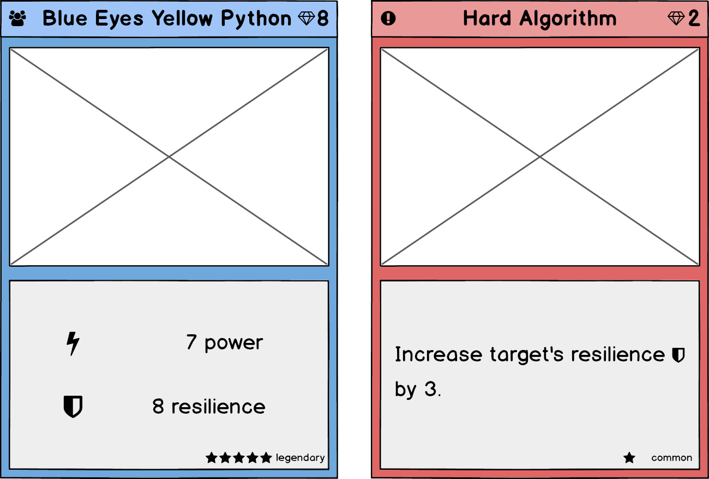
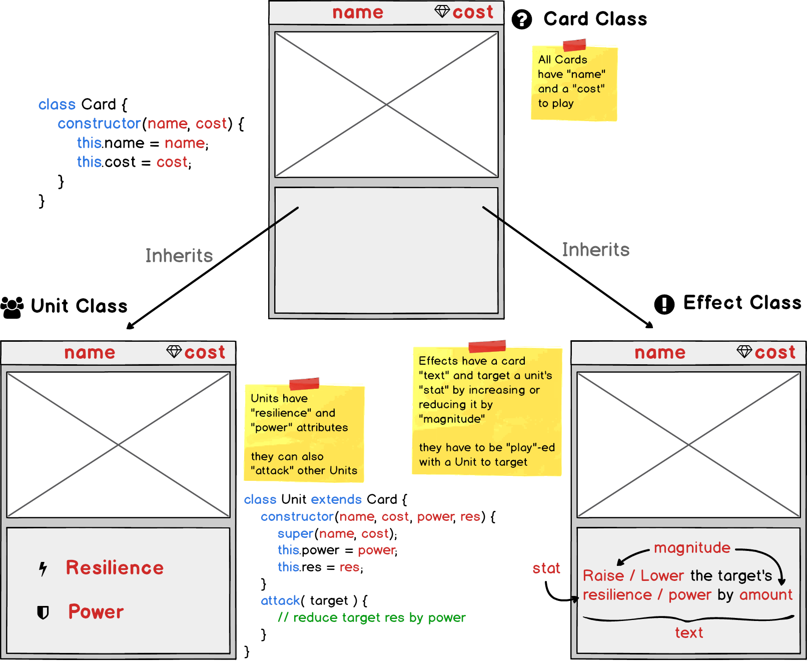
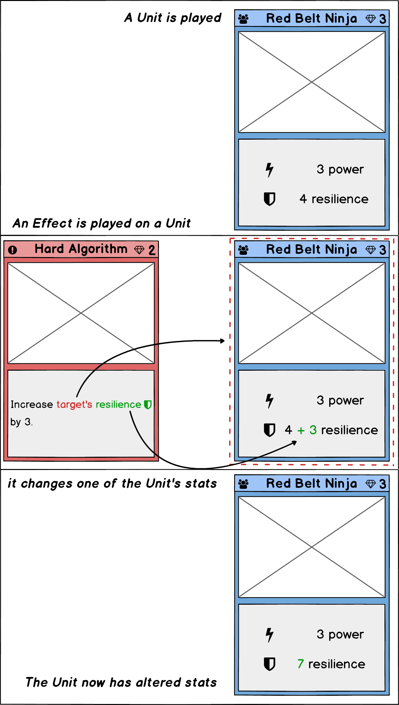

# Dojo CCG 

In this assignment you will design a Collectible Card Game in the style of Hearthstone, Yu-Gi-Oh!, or Magic: The Gathering. If you aren't familiar with these sorts of games, don't worry we will be explaining what you need to know about them.



In this game there will be two different types of Cards: Units and Effects. Units will be played to gain control of the board and will battle with units played by an opponent. Effects require a Unit to be targeted in order to be played. 



Effects will require a "target" when they are played. They increase or decrease either the power or the resilience of the "Unit" that they target. Similarly "Units" can attack other "Units", when they do they decrease the target's "resilience" by the attacker's "power". 



If we want to ensure that the target of a Unit's attack or an Effect is being played on a Unit, we can make use of `instanceof` to check that target is a "Unit". If it isn't we might want to throw an error to alert the user or programmer that the action won't be able to proceed.


```md
play( target ) {
    if( target instanceof Unit ) {
        // implement card text here
    } else {
        throw new Error( "Target must be a unit!" );
    }
}
````

# It's Time to Duel

### Unit Cards

| name             | cost | power | resilience |
| ---------------- | ---- | ----- | ---------- |
| Red Belt Ninja   | 3    | 3     | 4          |
| Black Belt Ninja | 4    | 5     | 4          |

### Effect Cards

| name                        | cost | text                              | stat       | magnitude |
| --------------------------- | ---- | --------------------------------- | ---------- | --------- |
| Hard Algorithm              | 2    | increase target's resilience by 3 | resilience | +3        |
| Unhandled Promise Rejection | 1    | reduce target's resilience by 2   | resilience | -2        |
| Pair Programming            | 3    | increase target's power by 2      | power      | +2        |

### Play out the following scenario

| turn | action                                                                           |
| ---- | -------------------------------------------------------------------------------- |
| 1    | Make an instance of "Red Belt Ninja"                                             |
| 1    | Make an instance of "Hard Algorithm" and play it on "Red Belt Ninja"             |
| 2    | Make an instance "Black Belt Ninja"                                              |
| 2    | Make an instance of "Unhandled Promise Rejection" and play iton "Red Belt Ninja" |
| 3    | Make an instance of "Pair Programming" and play it on "Red Belt Ninja"           |
| 3    | "Red Belt Ninja" uses the attack method on "Black Belt Ninja"                    |

- [x] Make an instance of Unit called "Red Belt Ninja"

- [x] Make an instance of Unit called "Black Belt Ninja"

- [x] Make an instance of Effect called "Hard Algorithm"

- [x] Make an instance of Effect called "Unhandled Promise Rejection"

- [x] Make an instance of Effect called "Pair Programming"

- [x] Play out the scenario described above
