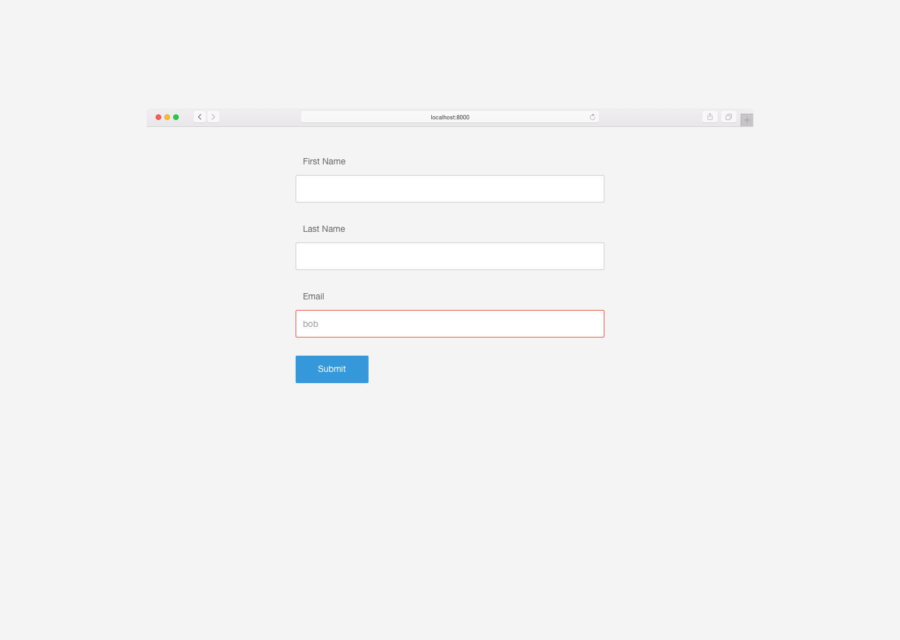

# Form Validation with useReducer
Using what we learned in the last lesson about the `useReducer` hook, develop an application with a form, three inputs (firstName, lastName, and email), and validate the form as the user types in the inputs. Consider setting your initialState to an object like the following:

```md
const initialState = {
    firstName: {
        value: '',
        error: null
    },
    lastName: {
        value: '',
        error: null
    },
    email: {
        value: '',
        error: null
    }
};
````
How you handle the validations is largely up to you. You can either create a validators object or pass a function to each of the inputs and run the appropriate validator function as a user types in that specific input. Also, React gives us a shorthand for rendering a bit of content if some condition is met. For example, consider using something along these lines to conditionally render an error.


```md
...
return (
    ...
    {state.firstName.error !== null && (
        <p className="error">{state.firstName.error}</p>
    )}
    ...
);
````

What this means is that we will only render the error if it's not null. Here's some help with validating an email address using regex.




