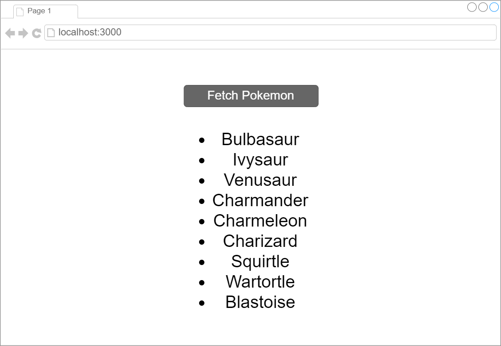

# Pokemon API

Using the previous lesson as a starting point, create a React project that simply has a button with the text "Fetch Pokemon".

When this is clicked, output the names of all 807 Pokemon using the [Pokemon API](https://pokeapi.co/).

- [x] Create a button to fetch the Pokemon

- [x] Output the names of all 807 Pokemon

<!DOCTYPE html>
<html lang="en">
<head>
    <meta charset="UTF-8">
    <meta name="viewport" content="width=device-width, initial-scale=1.0">
    <meta http-equiv="X-UA-Compatible" content="ie=edge">
    <title>Document</title>
</head>
<body>
    

    
</body>
</html>
