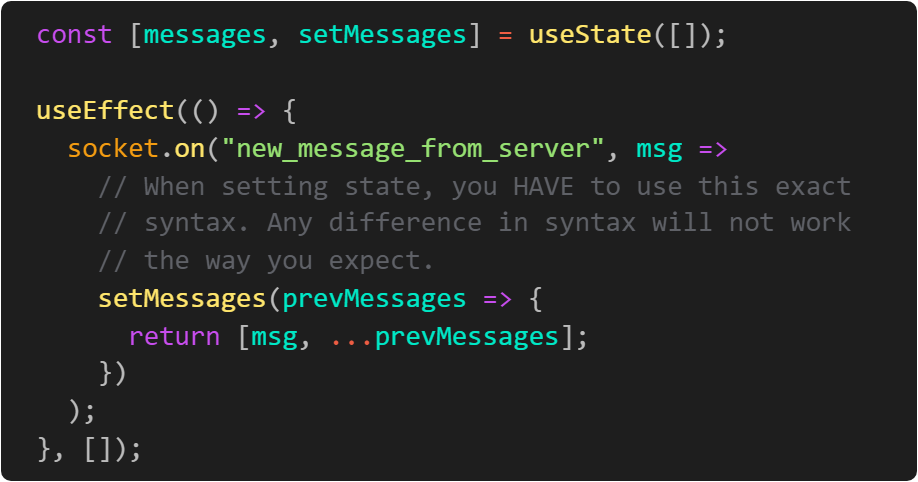
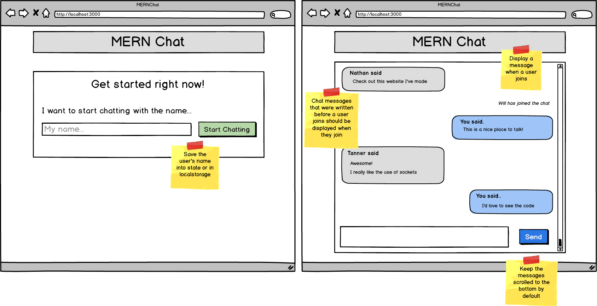

# Classic Chat App

Building off of the previous assignment, your task is to create a fully functional chat application. Have your cohort mates help test your application throughout your development process.

**There is ONE unspoken, not found on the internet, hard to fix, not straightforward bug when building your chat app.**

On the client, when you are setting state inside of an event listener, you will need to set state in a very, very specific way. Below is what you need to know. When you call your "setter" function, instead of passing it the new value, you need to pass it a callback function that will compute the new value based on the existing value. See the diagram below for an example.

Feel free to design your Chat App as you would like it, but for an example see the wireframe below.

### Resources

- (socket.io docs)[https://socket.io/docs/]
- (Functional Updates)[https://reactjs.org/docs/hooks-reference.html#functional-updates]

- [x] Build a fully functional chat application

- [x] Bonus: Keep the chat messages scrolled to the bottom by default

- [x] Ninja Bonus: Add different chat rooms that users can join

- [x] Sensei Bonus: Display chat messages from before a user has joined the chat when they join
