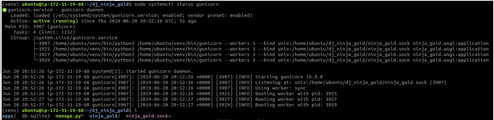
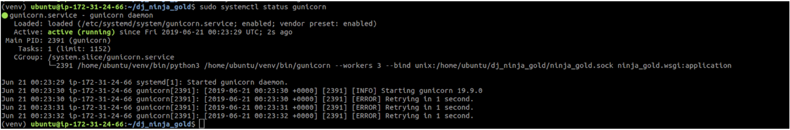
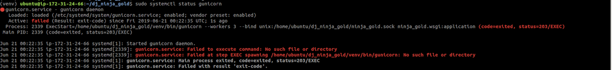

# Setup

### Objectives

- Get our local Python project ready for deployment
<hr>
Before we create our server we have to do some setup first. Choose a Django project with a database and let's get started!

When we are finished, our virtual machine will be set up to serve any Django project. This will enable you to make an easy swap with a new project (like your belt). We'll show you how later.

In this first section, we will be navigating around on our local machine. If you are using Unix (Mac), or Linux, these commands should look familiar to you. If you are on Windows, you will want to use git bash (i.e. not command prompt) for the purposes of deployment. These commands will also work in git bash.

1. Make sure the appropriate virtual environment is activated.
2. Once the virtual environment is activated, navigate into the correct project directory (same level as manage.py). We need to take a snapshot of all the installed pip modules into a .txt file. We'll use this file to install all of the required pip modules on our remote machine with a single command.

```md
(djangoPy3Env) project_name$ pip freeze > requirements.txt
```

Open the requirements.txt file and, if they exist, remove pygraphviz, pydot and anything with MySQL in it. These modules can be tricky to install and require additional installations, so we remove them now to prevent problems later. 4. Time to make a git repo! Make sure you're in the project directory (the same level as manage.py). First, let's create a [.gitignore](https://git-scm.com/docs/gitignore) file.

```md
(djangoPy3Env) project_name$ touch .gitignore
```

As the name implies, your gitignore file tells git to ignore any files, directories, etc. you include in the file.

5. Open your .gitignore file in your text editor and add these lines:

### project_name/.gitignore

```md
.vscode
env/
venv/
**pycache**/
.vscode/
db.sqlite3
```

6. Now initialize a git repository:

```md
(djangoPy3Env) project_name$ git init
(djangoPy3Env) project_name$ git add --all
(djangoPy3Env) project_name$ git commit -m "initial commit"
```

7. Create a new [GitHub](https://github.com/new) repo on GitHub. Copy the url of the new repository.
   In the terminal, run the commands (GitHub also provides these instructions upon repo creation):

```md
(djangoPy3Env) project_name$ git remote add origin https://github.com/your_github_username/your_github_repo_name
(djangoPy3Env) project_name$ git push origin master
```

# EC2 | Intro

### Objectives:

- Rent space from Amazon Web Services (AWS)
- Create an EC2 instance on AWS
<hr>
While there are many services out there that help with application deployment, we'll be using Amazon EC2. This service provides easily scalable servers and storage space in the cloud that makes deployment easy. Also, the lowest-tier servers are free. We are going to be renting some space on a computer owned by Amazon.

We have been using our own computer, localhost, to host our applications for us. Our computer was not designed to be a server, it was designed to be a client. Amazon has some powerful computers that can run multiple high traffic applications so we will be renting a small corner of a very large and powerful server computer.

Before we get started, make sure you have signed up for AWS Free Tier [here](http://aws.amazon.com/free/). AWS requires you to provide a credit card during sign up, but don't worry; AWS will only charge you if you purchase non-free services. AWS will not charge you upon signing up. (In this chapter, we will demonstrate how to run a free instance. Amazon EC2 offers up to 1 year of free use so that programmers like us can enjoy the free service.)

1. Log in to the AWS console at [https://aws.amazon.com/](https://aws.amazon.com/)
2. Once you have logged in, click on Services and click on EC2.

 3. Launch a new instance from the EC2 Dashboard by clicking Launch Instance as shown below.

 4. Select **Ubuntu Server 18.04, SSD Volume Type** option. Do NOT select Ubuntu 16.04


5. Select the t2.micro option and click Review and Launch.

 6. Click the Edit security groups link in the lower right corner.


7. SSH option should be there already. Update its source to MyIP. Click the add a rule button and add HTTP and HTTPS, set source to Anywhere, and then click Review and Launch.


(If you plan on reconnecting to this instance from a different location, see the Reconnecting module at the end of this chapter.)

8. Next, you'll be asked to create a key file. This is what will let us connect and control the server from our local machine.

Name your pem key whatever makes the most sense to you as shown in the next step. Give it a generic name, not the name of your project, as we can reuse this key.


9. Click Download Key Pair. The key will automatically be saved wherever your browser saves by default. This next part is very important! Put your pem key in a file that has no chance of EVER being pushed to GitHub or anywhere public. You should not send this file via email, or in any other way make it publicly available:


10. After launching your instance, you will see a screen with lots of information. Scroll to the bottom of the page and click View Instances.
    

11. (Optional) Once you have several instances running, you will want to be able to identify what your different instances are for. We have the option of naming our instance, so let’s do so now by clicking on our instance’s name column as shown.


# Server Access

### Objectives

- Connect to our AWS server instance!
<hr>

1. Back in your terminal, navigate to the folder that holds the pem key file you just downloaded. Now we’re ready to use our .pem file to connect to the AWS instance!
   - **Windows users:** you cannot use the command prompt for this. Use git bash or another terminal that allows for ssh.
2. In your AWS console, click Connect at the top of your screen and use the supplied code in your terminal (PC users: use a bash terminal to do this).


3. A popup will appear with instructions on how to connect. Copy the two commands, highlighted in the red boxes, and paste them in your terminal.


```md
the_folder_containing_your_pem_file$ chmod 400 your_pem_name.pem
the_folder_containing_your_pem_file$ ssh -i "your_pem_name.pem" ubuntu@your_instance_address_here
```

4.You will likely be prompted to continue. Type `yes` and wait for a few seconds. If all goes well, you should be on your Ubuntu cloud server. Your terminal should show something like this in the far left of your prompt, signaling you are now logged into your AWS instance! We are no longer affecting our own computer--we are now remotely logged into the server we are renting from Amazon!

```md
ubuntu@54.162.31.253:~$ #Commands you write appear here
```

# Server Configuration

### Objectives:

- Install the necessary programs on our AWS instance

1. Now we are going to set up our remote server for deployment. Our server is nothing more than a small allocated space on someone else’s larger computer (in this case, the big computer belongs to Amazon!). That space has an installed operating system, just like your computer. In this case, we are using a distribution of Linux called Ubuntu, version 18.04.
2. Although we have linux, our new computer is otherwise empty. Let’s change that so we can start building a server capable of providing content that the rest of the world can access. Let's check for updates first.

```md
ubuntu@54.162.31.253:~$ sudo apt-get update
```

3. Now let's install nginx

```md
ubuntu@54.162.31.253:~$ sudo apt-get install nginx
```

4. Let's make a clone of our git repository on this machine. (NO SUDO!)

```md
ubuntu@54.162.31.253:~$ git clone https://github.com/your_username_here/your_repo_name_here
```

5. Let's now install venv so we can create a virtual environment.

```md
ubuntu@54.162.31.253:~$ sudo apt-get install python3-venv //Say YES when prompted
```

6. Navigate to your repository folder

```md
ubuntu@54.162.31.253:~$ cd {{ repo name }}
```

7. Now let's create a virtual environment and activate it.

```md
ubuntu@54.162.31.253:~/myRepoName$ python3 -m venv venv //We are using the venv command and naming our virtual env venv
ubuntu@54.162.31.253:~/myRepoName$ source venv/bin/activate
```

8. Let's now install the dependencies that we will need in our virtual environment.

9. ```md
   (venv) ubuntu@54.162.31.253:~/myRepoName$ pip install django==2.2
   (venv) ubuntu@54.162.31.253:~/myRepoName$ pip install bcrypt
   (venv) ubuntu@54.162.31.253:~/myRepoName$ pip install gunicorn
   ```

````
# VIM
### Objectives:
- Learn about VIM, a text editor for Unix
- Learn a few basic commands for VIM
<hr>
If you have used VIM before, skip to the next tab.

VIM is a terminal based file editor. We will use it to change the necessary files in order to get our project running. In the following instructions, you'll be using the `vim` command to enter the editor. The `vim` command can be used either to:

- edit existing files, or
- create and open a new blank file.
Because there is no GUI (graphical user interface), it's important to learn a few keyboard commands for navigating around VIM:

- `i` - enter INSERT mode. You should see `–INSERT–` at the bottom left corner of your terminal. Now use your arrow keys to move the cursor to where you want to edit and make your changes.
- `esc` - exit INSERT mode.
- `:` - when not in INSERT mode, enters the vim command interface. You should now see a colon at the bottom left corner of your terminal.
    - `w` and `Enter` - save.
    - `wq` and `Enter` - save and quit.
    - `q!` and `Enter` - quit without saving.

# Modifying Settings
### Objectives:
- Update our deployed settings.py file
<hr>

IMPORTANT
Anywhere you see {{myRepoName}} – replace that whole thing INCLUDING the {{}} with your outer folder name (same as GitHub repository name).
Anywhere you see {{projectName}} – replace that whole thing INCLUDING the {{}} with the project folder name (the name of your Django project).
Anywhere you see {{yourEC2.public.ip}} – replace that whole thing INCLUDING the {{}} with the public IP address of your newly created server.
<hr>

If you named your repo something different from your project, the repo name and project name may be different, but it is okay if they are the same.

1. Navigate into your main project directory, where `settings.py` lives.
```md
(venv) ubuntu@54.162.31.253:~/myRepoName$ cd {{projectName}}
````

2. We're going to use a built-in text editor (VIM) in the terminal to update the code in `settings.py`.

```md
(venv) ubuntu@54.162.31.253:~/myRepoName/projectName$ sudo vim settings.py
```

3. You'll need to add a line that allows you to serve static content. You'll also need to modify a couple of lines, as follows. Don't forget to type `i` to enter insert mode.

```md
# inside settings.py

# modify these lines

DEBUG = False
ALLOWED_HOSTS = ['{{yourEC2.public.ip}}'] # keep the quotes!
STATIC_ROOT = os.path.join(BASE_DIR, "static/") # add this line at the bottom; don't replace any existing lines!
```

Save and quit. (`esc`, `:wq`, `enter`)

4. Navigate back to the folder that holds `manage.py`. Make sure your virtual environment is still activated!

```md
(venv) ubuntu@54.162.31.253:~/myRepoName/projectName$ cd ..
```

5. Gather all of the static files in your project into one location:

```md
(venv) ubuntu@54.162.31.253:~myRepoName$ python manage.py collectstatic # type yes when prompted
```

6. If you ignored your db and/or migrations files, this is a great time to also make and run migrations, just as you would have done on your local machine!

```md
(venv) ubuntu@54.162.31.253:~myRepoName$ python manage.py makemigrations
(venv) ubuntu@54.162.31.253:~myRepoName$ python manage.py migrate
```

# Gunicorn

### Objectives:

- Set up gunicorn
<hr>
You may remember that Gunicorn is our process manager. Let's get it set up.

1. Let's first test Gunicorn by directing it to our Django project's wsgi.py file, which is the entry point to our application.

```md
(venv) ubuntu@54.162.31.253:~myRepoName$ gunicorn {{project_name}}.wsgi
```

If your Gunicorn process ran correctly, you will see something like the following printed to the terminal:

```md
[2016-12-27 05:45:56 +0000] [8695] [INFO] Starting gunicorn 19.6.0
[2016-12-27 05:45:56 +0000] [8695] [INFO] Listening at: http://0.0.0.0:8000 (8695)
[2016-12-27 05:45:56 +0000] [8695] [INFO] Using worker: sync
[2016-12-27 05:45:56 +0000] [8700] [INFO] Booting worker with pid: 8700
```

Exit the process by typing `ctrl-c`.

Deactivate the virtual env by typing `deactivate`

2. Now we're going to set up Gunicorn to run as a service. You'll be using systemd as your init system to manage and control aspects of your server including services. The primary advantage of turning Gunicorn into a service is that Gunicorn will start with the server after being rebooted and once configured will just work. To be able to turn Gunicorn on and off, we're going to create a systemd service file and make some changes.

```md
ubuntu@54.162.31.253:~myRepoName$ sudo vim /etc/systemd/system/gunicorn.service
```

3. In the VIM text editor, copy and paste the following code. Don't forget to type i before copying and pasting the lines below!

```md
[Unit]
Description=gunicorn daemon
After=network.target
[Service]
User=ubuntu
Group=www-data
WorkingDirectory=/home/ubuntu/{{myRepoName}}
ExecStart=/home/ubuntu/{{myRepoName}}/venv/bin/gunicorn --workers 3 --bind unix:/home/ubuntu/{{myRepoName}}/{{projectName}}.sock {{projectName}}.wsgi:application
[Install]
WantedBy=multi-user.target
```

4. Now that our service file has been created, we can enable it so it starts on boot.

```md
ubuntu@54.162.31.253:~$ sudo systemctl daemon-reload # systemctl ends with the letter L, not a number
ubuntu@54.162.31.253:~$ sudo systemctl restart gunicorn
ubuntu@54.162.31.253:~$ sudo systemctl status gunicorn
```

You should see a green dot next to gunicorn.service and the lines "Booting worker with pid: ....". It should look like this;



Note: if any additional changes are made to the gunicorn.service the previous three commands will need to be run in order to sync things up and restart our service.

5. CHECK: Type `ls`. If you DO NOT see a {{projectName}}.sock file, double and triple check the file from above (case sensitivity, appropriate spacing, spelling, etc.).

### Troubleshooting Steps and Common Errors:

If you see output that looks like this when you start your gunicorn service:


It is likely that you cloned your repository with sudo or created your virtualenv with sudo. If that is the case, terminate your EC2 instance and start over.

If you see output that looks like this:


Read the error message it gives you. This will often be a typo in one of your configuration files. Another common error is not installing Gunicorn and Django in the same environment. Go over the steps again until you see the green dot output.
