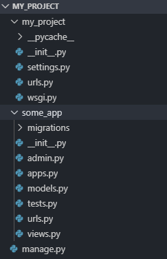
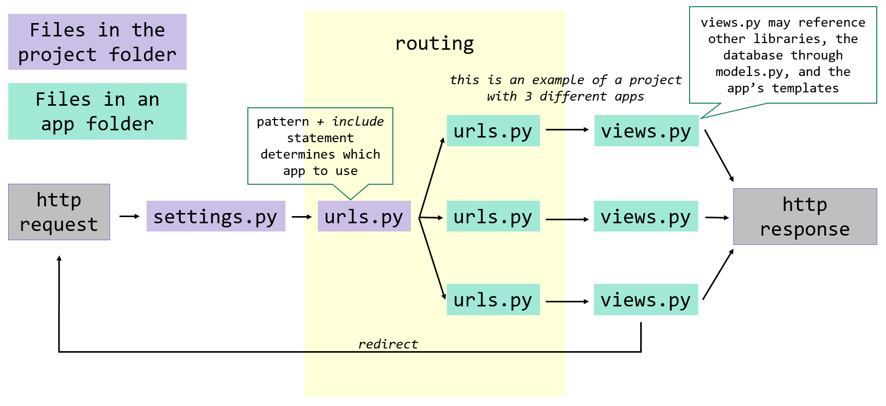
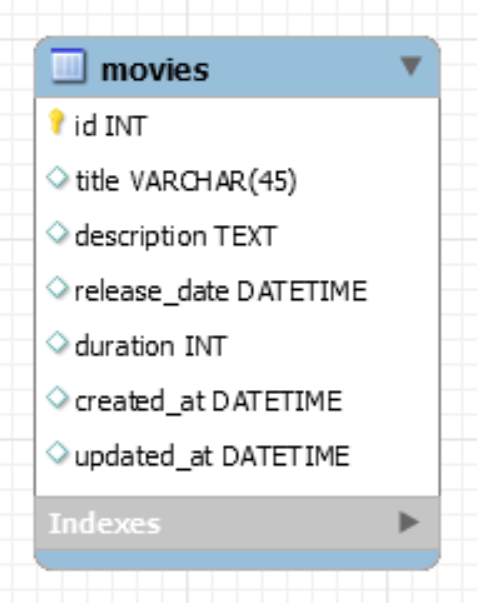
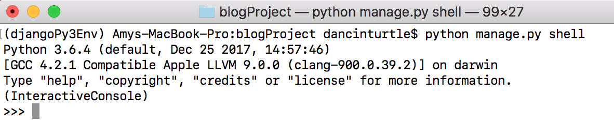

# Creating a Django Project

### Objectives:

- Practice the steps for creating a Django project with a single app
- Familiarize ourselves with the role of each file
<hr>

So we've talked about modularization and MTV (and MVC), but what does that really mean? Let's go ahead and build a Django project, and then we'll review the folder structure to really see what modularization is all about.

Remember that a single application in Django (in our case, every assignment) is called a project, which contains one or more apps.

1. With our Django virtual environment activated, create a new Django project. First navigate to where you want the project to be saved (for these first few assignments, that will be the python_stack/django/django_intro folder). Then run this command, specifying a project name of our choosing:

```md
cd python_stack/django/django_intro
django_intro> django-admin startproject your_project_name_here
```

- Let's test this out:

Navigate into the folder that was just created. A new Django project has just been created--let's run it!

```md
django_intro> cd your_project_name_here
your_project_name_here> python manage.py runserver
```

Open `localhost:8000` in a browser window. Hooray for CLIs (command-line interfaces)!

(Don't worry about the warning about unapplied migrations. It won't affect us for now, and we'll address it soon enough.)

Press `ctrl-c` to stop the server. Open up the project folder in your text editor. (Take note of the folder structure so far!) We'll be updating some of these files shortly.

2. For every app we want to add to our project, we'll do the following:

```md
your_project_name_here> python manage.py startapp your_app_name_here
```

**The apps in a project CANNOT have the same name as the project.**

In the text editor, find the settings.py file. It should be in a folder with the same name as our project. Find the variable INSTALLED_APPS, and let's add our newly created app:

### your_project_name_here/your_project_name_here/settings.py

```md
INSTALLED_APPS = [
'your_app_name_here', # added this line. Don't forget the comma!!
'django.contrib.admin',
'django.contrib.auth',
'django.contrib.contenttypes',
'django.contrib.sessions',
'django.contrib.messages',
'django.contrib.staticfiles',
] # the trailing comma after the last item in a list, tuple, or dictionary is commonly accepted in Python
```

3. For these next few steps, we are creating the route "/" to be associated with a specific function. Trust for now--we'll break this down in greater detail in the next tab. In the urls.py file, add a URL pattern for your new app. (You can delete the current admin pattern, or just ignore it for now). You will need to add an import for your views file.

### your_project_name_here/your_project_name_here/urls.py

```md
from django.urls import path, include # import include

# from django.contrib import admin # comment out, or just delete

urlpatterns = [
path('', include('your_app_name_here.urls')),
 # path('admin/', admin.sites.urls) # comment out, or just delete
]
```

4. Next, let's create a new urls.py file in the your_app_name_here folder. Put the following code

```md
your_project_name_here/your_app_name_here/urls.py
from django.urls import path  
from . import views
urlpatterns = [
path('', views.index),
]
```

And then actually put a function called index in our app's views.py file:

### your_project_name_here/your_app_name_here/views.py

```md
from django.shortcuts import render, HttpResponse
def index(request):
return HttpResponse("this is the equivalent of @app.route('/')!")
```

Let's run our app again and check it out at `localhost:8000/`. Whew. We've done it!

```md
your_project_name_here> python manage.py runservercopy
```

**Note: Do not manually change the name of any of your folders after creation!**

For a quick summary/visual overview, here's the structure we should have after all these steps, inside the project folder.



# Django Routing
### Objectives:
- Understand how routes are divided between project and app level urls.py files
- Understand how requests are resolved from the urls.py files to the views.py file
<hr>

We have a new Django project running, but what was all that code we added there at the end? 

**project_name/project_name/urls.py**
```md
from django.urls import path, include
    
urlpatterns = [
    path('', include('app_name.urls')),
]
````
The `urlpatterns` is simply a variable that holds a list of urls that this project recognizes. Notice there are 2 arguments being passed to the url function:

a raw string representing a route pattern (in our example: `''`)
what to do if the pattern matches (in our example: `include('app_name.urls'))`
The second argument, `include('app_name.urls')` will resolve the rest of the route. So let's go there:

**project_name/app_name/urls.py**
```md
from django.urls import path
from . import views	# the . indicates that the views file can be found in the same directory as this file
                    
urlpatterns = [
    path('', views.index),
]
````
This is the same url function, but this time our arguments indicate that:

1. `''` - the rest of the route both starts and ends with nothing (i.e. "/" is the full route), and
2. `views.index` - if the requested route matches this pattern, then the function with the name "index" from this app's views.py file will be invoked.

If the route wants a views.index function, then we'd better have one:

**project_name/app_name/views.py**
```md
from django.shortcuts import render, HttpResponse
def index(request):
    return HttpResponse("response from index method from root route, localhost:8000!")
````
A couple of important things to notice here:

1. Every function's first argument will be the request object.
2. We don't distinguish in our routes anywhere between GET vs POST requests. This will be done within a given function.
3. If we are returning a string, we cannot simply return a string, but must send the string via HttpResponse (which must be imported. We'll be returning rendered templates again soon enough!)

Here's a visual of how routes get resolved in a Django project:


# Routing with Parameters
### Objectives:
- Learn how to capture variables from the url
<hr>

In this module, we will look into how Django interprets a request with varying values.

Learn more from the [documentation](https://docs.djangoproject.com/en/2.2/topics/http/urls/#how-django-processes-a-request).

Here are a few examples, to demonstrate the syntax:

**some_project/some_app/urls.py**
```md
urlpatterns = [
        path('bears', views.one_method),                        # would only match localhost:8000/bears
        path('bears/<int:my_val>', views.another_method),       # would match localhost:8000/bears/23
        path('bears/<str:name>/poke', views.yet_another),       # would match localhost:8000/bears/pooh/poke
    	path('<int:id>/<str:color>', views.one_more),           # would match localhost:8000/17/brown
]
````
The corresponding functions would then look like this:

**some_project/some_app/views.py**
```md
def one_method(request):                # no values passed via URL
    pass                                
    
def another_method(request, my_val):	# my_val would be a number from the URL
    pass                                # given the example above, my_val would be 23
    
def yet_another(request, name):	        # name would be a string from the URL
    pass                                # given the example above, name would be 'pooh'
    
def one_more(request, id, color): 	# id would be a number, and color a string from the URL
    pass                                # given the example above, id would be 17 and color would be 'brown'
````
# Response Types
In Django, there are many different ways we can return a response.  We will look into returning a HTML template in the next lesson, for now let's focus on these.

- HttpResponse: Can be used to pass a string as a response.
- Redirect: Used to navigate to a different view method, before a final response is sent to the client. ***Note*** Even though we don't include the first / in our project urls.py file, when redirecting, you should provide the whole path, starting with the first /.
- JsonResponse: Used to return a JSON object

urls.py
```md
from django.urls import path
from . import views
urlpatterns = [
    path('', views.root_method),
    path('another_route', views.another_method),
    path('redirected_route', views.redirected_method
]
````
views.py
```md
from django.shortcuts import HttpResponse, redirect # add redirect to import statement
from django.http import JsonResponse
def root_method(request):
    return HttpResponse("String response from root_method")
def another_method(request):
    return redirect("/redirected_route")
def redirected_method(request):
    return JsonResponse({"response": "JSON response from redirected_method", "status": True})
````

# Models in the MTV (MVC) Structure
### Objectives:
- Understand why Models are a separate component of the MTV (MVC) architecture
- Learn how to build a Django model
<hr>

### The Why
Let's get started using the ORM! Models are the M of the MTV architecture. Remember that the goal of modularizing is to separate our code so that each part has a specific purpose.

The purpose of models is to do all the work of interfacing with the database, whether retrieving information from or putting information into it. The phrase skinny controllers and fat models is often used to describe this design pattern:

As a general rule, any heavy logic, including database queries, should be performed by the Model. If a controller (in Django, that's the views.py file) needs to perform logic or get information from the database, it should use a Model method to do so.

### The How
When we created our app, the Django CLI actually set up the models.py file for us. So far we have left it empty, but it's finally time to use it!

Models are simply classes that map to our database tables. We'll start with just one table, and then talk about adding relationships over the next few modules and assignments. On the left is the ERD as we might have designed it in MySQL Workbench. On the right is the corresponding class we will actually write in our models.py file.

### Hypothetical MySQL Workbench Diagram
### my_app/models.py


```md  
class Movie(models.Model):
    title = models.CharField(max_length=45)
    description = models.TextField()
    release_date = models.DateTimeField()
    duration = models.IntegerField()
    created_at = models.DateTimeField(auto_now_add=True)
    updated_at = models.DateTimeField(auto_now=True)
````

Let's break down the code in the models.py file a little bit:

#### Why models.Model?
First, notice we are inheriting from the `models.Model` base class. If you didn't have a chance to practice inheritance back in the OOP chapters, inheritance is an important OOP principle that allows us to write code in one class (parent) and then allow other classes (children) to inherit that same code without having to re-write it in the child classes.

Practically speaking, this means that, even though we don't see additional code, Django's Model class provides a lot right out of the box. There's no way the Django developers could have anticipated all the different classes we as developers might create, but what they could anticipate was that we'd need classes, and that these classes would need to be created in our database, and they'd each need a primary key field. With that in mind, they created one generic parent Model class that contains these fields and functionalities.

You'll notice, for example, that we do not need to type an `id` field into any of our classes--Django automatically adds a field called "id" to every class inheriting from models.Model and sets it to be an auto-incremented field. We also don't have to write a separate `__init__` method for each class. Very shortly, we'll also see the models come pre-loaded with all the CRUD functionality so we aren't required to write out all the SQL statements.

#### Other Fields
Besides the id field, you'll notice that every field from our ERD has a corresponding line in our class. Each field is named and its type is specified. (We won't talk about relationship fields yet--those will come soon enough!) This is a great opportunity to begin reading documentation. The documentation will tell you what is required for each field type and what other options you can specify for each field. You can find a full list of allowed column types [here](https://docs.djangoproject.com/en/2.2/ref/models/fields/#field-types). Below is a list of a few common types with some brief explanations to help you get started.

- **CharField**

    Any text that a user may enter. This has one required parameter, max_length, that is the maximum length of text that can be saved.
- **TextField**

    Like a CharField, but with no maximum length. Your user could copy the entire text of the Harry Potter series into the field and it would save in the database correctly.
- **IntegerField**

    Holds an integer value
- **FloatField**

    Holds a float value; this is good for numbers with potentially varying numbers of decimal places
- **DecimalField**

    This is a good field for a number with a fixed number of decimal places, like currency. There are 2 required parameters: max_digits refers to the total number of digits (before and after the decimal place), and decimal_places refers to how many decimal places.
- **BooleanField**

    Holds a boolean value
- **DateTimeField**

    Used for a combination of a specific date and time. This field can take two very useful optional parameters. Setting the auto_now_add argument to True adds the current date/time when an object is created. Setting auto_now=True automatically updates any time the object is modified.

# Migrations
### Objectives:
- Learn how to create a database and table(s) in SQLite based on our model(s)
- Understand what migrations do
<hr>

Now that we've set up our models, it's time to create an actual database with some tables! Luckily, Django can do the whole job for us with minimal code.

To do this, (basically the equivalent of forward engineering in MySQL Workbench), we are going to run a couple of commands from the terminal.
```md
  > python manage.py makemigrations
  > python manage.py migrate
````
**makemigrations** is a kind of staging. When this command runs, Django looks through all our code, finds any changes we made to our models that will affect the database, and then formulates the correct Python code to move on to the next step. Note that if this step has errors, the next step will not work, so you will need to fix any errors before you can move on to migrating.

**migrate** actually applies the changes made above. This step is where the SQL queries are actually built and executed.

The migration process is split into two steps so that Django can check and make sure you wrote code it can understand before moving on to the next step.

**A Few Notes:**
1. Never delete migration files and always `makemigrations` and `migrate` anytime you change something in your `models.py` files – that's what updates the actual database so it reflects what's in your models.
2. For now we are going to be using SQLite, a SQL database that comes pre-packaged with Django. It is best used in a development environment because it is stored as local memory in a file and as such is very fast. It is generally not recommended for use once our application is ready for production. Luckily, changing what kind of database we are using is quite simple. In the deployment section, we'll learn how to switch to a MySQL database.
3. Django ORM models and queries will always be the same no matter which database we are using.


# Django Shell
### Objectives:
- Learn what the Django Shell is
- Learn how to import models into the shell
<hr>

Before tying models directly into our web applications, we're going to take a minute to open the Django shell to interact with our models and practice writing queries using Django's ORM.

To use the shell, we'll run the following command in our terminal from our project's root directory (where our manage.py file is located):
```md
> python manage.py shell
````
Your terminal output should look like this:


Once we're in the shell, we can access all of our functions and classes in our files. To do so, we just need to specify which modules (files) we need. Since we are interested specifically in working with our models, let's import them:
```md
>>> from your_app_name_here.models import *
````
**We will need to run this import every time we start the shell.**

Caution:  Since models.py contains the classes you wrote, importing everything in models.py is okay, but generally when you're importing other libraries/modules, the Django community discourages the practice of importing all (*). A good explanation can be found here: [https://stackoverflow.com/questions/2360724/what-exactly-does-import-import](https://stackoverflow.com/questions/2360724/what-exactly-does-import-import). 

### Viewing the Database
We can always use the shell to view the data in our database, but sometimes it can be frustrating to figure out how objects map to rows in a table. If you find the shell too frustrating to navigate, you can use a program called DB Browser for SQLite to view your database tables. DB Browser can be downloaded [here](https://sqlitebrowser.org/dl/).


# ORM CRUD Commands
### Objectives:
- Learn/have a reference for basic ORM CRUD (Creating, Reading, Updating, and Deleting) commands
<hr>
Now that you have imported your models, let's start talking queries! This module is a little bit long--spend just a few minutes reading through to get familiar with what we're about to do. Just like we learned INSERT, SELECT, UPDATE, and DELETE statements in MySQL, we'll need methods that have the same functionality as those query commands.

Once you've spent just a few minutes reviewing CRUD in this module, jump into the Users assignment! Use this module as a guide to practice each of the queries in the shell. Remember, the best way to learn is by doing!

While SQL understands data in terms of tables and rows, in Django we'll refer to our data in terms of classes and class instances. Each row of data is an instance of the associated class. Even though a class instance is more than a dictionary, we can still think of an instance kind of like a dictionary, where our class's field names are the keys, and the actual data from our database are the values.

### Overview of Commands
- Creating a new record
    - ClassName.objects.create(field1="value for field1", field2="value for field2", etc.)
- Reading existing records
    - Methods that return a single instance of a class
        - ClassName.objects.first() - gets the first record in the table
        - ClassName.objects.last() - gets the last record in the table
        - ClassName.objects.get(id=1) - gets the record in the table with the specified id
            - this method will throw an error unless only and exactly one record matches the query
    - Methods that return a list of instances of a class
        - ClassName.objects.all() - gets all the records in the table
        - ClassName.objects.filter(field1="value for field1", etc.) - gets any records matching the query provided
        - ClassName.objects.exclude(field1="value for field1", etc.) - gets any records not matching the query provided
- Updating an existing record
    - c = ClassName.objects.get(id=1)
    - c.field_name = "some new value for field_name"
    - c.save()
- Deleting an existing record
    - c = ClassName.objects.get(id=1)
    - c.delete()
- Other helpful methods
    - Displaying records
        - ClassName.objects.get(id=1).__dict__ - shows all the values of a single record as a dictionary
        - ClassName.objects.all().values() - shows all the values of a QuerySet (i.e. multiple instances)
    - Ordering records
        - ClassName.objects.all().order_by("field_name") - orders by field provided, ascending
        - ClassName.objects.all().order_by("-field_name") - orders by field provided, descending

To take a deeper dive into any of these commands, keep scrolling. For the next few assignments, we'll be running all these commands in the shell. Once we go full stack, we will utilize these queries in our `views.py` file. The examples below utilize this model:

```md
class Movie(models.Model):
    title = models.CharField(max_length=45)
    description = models.TextField()
    release_date = models.DateField()
    duration = models.IntegerField()
    created_at = models.DateTimeField(auto_now_add=True)
    updated_at = models.DateTimeField(auto_now=True)
````
### CREATING
To add a new record to a table:
- ClassName.objects.create(field1="value for field1", field2="value for field2", etc.)
- SQL Equivalent: "INSERT INTO tablename (field1, field2) VALUES ('value for field1', 'value for field2');"

The create method returns an instance of the model with the values that were just added. This means that if we wanted to do something with the instance after creating in our database, we could set a variable and use it like so:
```md 
newly_created_movie = Movie.objects.create(title="The Princess Bride",description="the best movie ever",release_date="1987-09-25",duration=98)
print(newly_created_movie.id)	# view the new movie's id
````

Another way to add a row to our database is by creating an instance of the class (think back to the OOP section) and saving it, like so:
```md
newly_created_movie = Movie(title="The Princess Bride",description="the best movie ever",release_date="1987-09-25",duration=98)
newly_created_movie.save()
````
By default, all fields in our models are non-nullable, meaning all fields are required upon creation. If you want to change this default behavior, check out [Django's documentation](https://docs.djangoproject.com/en/1.11/ref/models/fields) on the null property.
### READING
There are several ways that we might want to retrieve records from the database.

### Multiple Records
There are several different methods that will return multiple records (or lists of instances).

### All
To get all the rows from a given table:

- ClassName.objects.all()
- SQL Equivalent: "SELECT * FROM tablename;"

The all method returns a list (technically a QuerySet) of instances of the model.
```md
all_movies = Movie.objects.all()
````
### Filter (WHERE)
To specify criteria for retrieving rows from a given table:

- ClassName.objects.filter(field1="value to match", field2="another value", etc.)
- SQL Equivalent: "SELECT * FROM tablename WHERE field='value to match' AND field2='another value';"

The filter method also returns a list (technically a QuerySet) of instances of the model.  
```md
some_movies = Movie.objects.filter(release_date='2018-11-16')
````
### Exclude (WHERE NOT)
To specify criteria for filtering out records to retrieve:

- ClassName.objects.exclude(field1="value to match", field2="another value", etc.)
- SQL Equivalent: "SELECT * FROM tablename WHERE NOT (field='value to match' AND field2='another value');"

The exclude method also returns a list (technically a QuerySet) of instances of the model.  
```md
other_movies = Movie.objects.exclude(release_date='2018-11-16')
````
When we have a list of instances, we can iterate through that list and view each instance and its values:
```md 
for m in all_movies:    # m represents each movie instance as we iterate through the list
    print(m.title)	# that means m has all the properties of the Movie class, including title, release_date, etc.
````

### Single Records
There are also several different methods that will return a single instance of a class.

### Get
To get a specific row from the table, specify a field and value.

- ClassName.objects.get(field1="unique value")
- SQL Equivalent: "SELECT * FROM tablename WHERE field1='unique value' LIMIT 1;"

The get method returns a single instance of the model.
```md
one_movie = Movie.objects.get(id=7)
````

If our specified value(s) finds no matching results or more than one matching result from the database, we will get an error. This is why we should really only use fields that we know will be unique, with values that we are certain are in the database. For this reason, `id` is the most common field to use with get.

### First
To get the first row from the table:

- ClassName.objects.first()
- SQL Equivalent: "SELECT * FROM tablename ORDER BY id LIMIT 1;"

The first method returns a single instance of the model. If no order is specified before calling the first method, the data is ordered by the primary key.

```md
first_movie = Movie.objects.first()
````
### Last
To get the last row from the table:

- ClassName.objects.last()
- SQL Equivalent: "SELECT * FROM tablename ORDER BY id DESC LIMIT 1;"

The last method returns a single instance of the model. Again, if no order is specified before calling the last method, the data is ordered by the primary key.
```md
last_movie = Movie.objects.last()
````
When we are working with a single instance, we can access any of the instance's values with dot notation. For example:
```md
print("Movie 7", one_movie.title)
print("First movie", first_movie.release_date)
print("Last movie", last_movie.description)
````
### UPDATING
In order to update an existing record, we first need to obtain the instance of the record we want to modify and then use the save method to commit those changes to the database. For example:
```md
movie_to_update = Movie.objects.get(id=42)	# let's retrieve a single movie,
movie_to_update.description = "the answer to the universe"	# update one/some of its field values
movie_to_update.title = "The Hitchhiker's Guide to the Galaxy"
movie_to_update.save()	# then make sure all changes to the existing record get saved to the database
````
The equivalent SQL statement would be:

- "UPDATE tablename SET field1='new value', field2='new value' WHERE id=id_value;"

### DELETING
In order to delete an existing record, we again need to obtain the instance of the record and then use the delete method. For example:
```md
movie_to_delete = Movie.objects.get(id=2)	# let's retrieve a single movie,
movie_to_delete.delete()	# and then delete it
````
The equivalent SQL statement would be:

- "DELETE FROM tablename WHERE id=2;"

### Helpful Tip
You've probably noticed in the shell that printing whole objects just results in something like `<Movie Object (1)>`, which is not particularly helpful. To change how our models display, we can override the `__str__` method in the class. This is pretty handy and shows how we can leverage some of Python's magic methods to make our lives easier.

```md
class Movie(models.Model):
    # fields removed for brevity
    def __str__(self):
        return f"<Movie object: {self.title} ({self.id})>"
````
**OPTIONAL: iPython**
Also, if you would like, you could also install iPython (pip install ipython). This replaces the default shell with a prettier one (TAB indent works, line numbers, syntax highlighting, etc).

